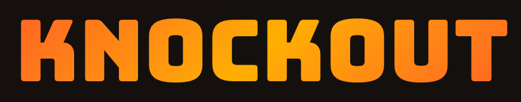
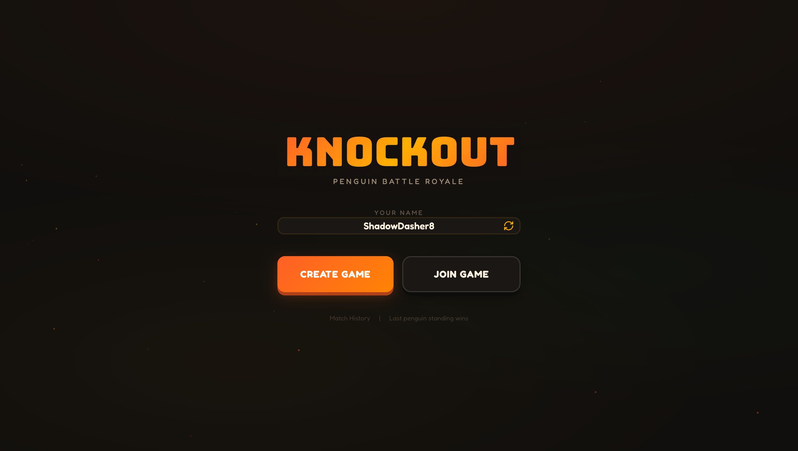
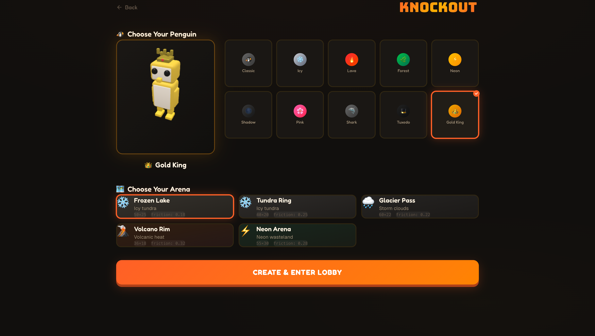
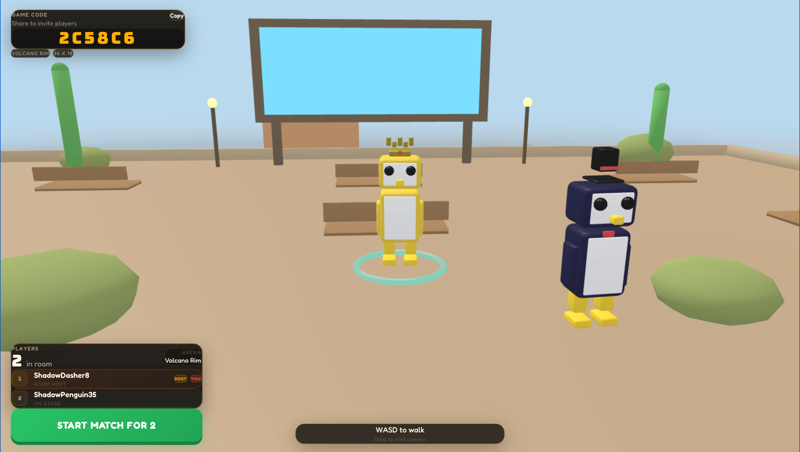
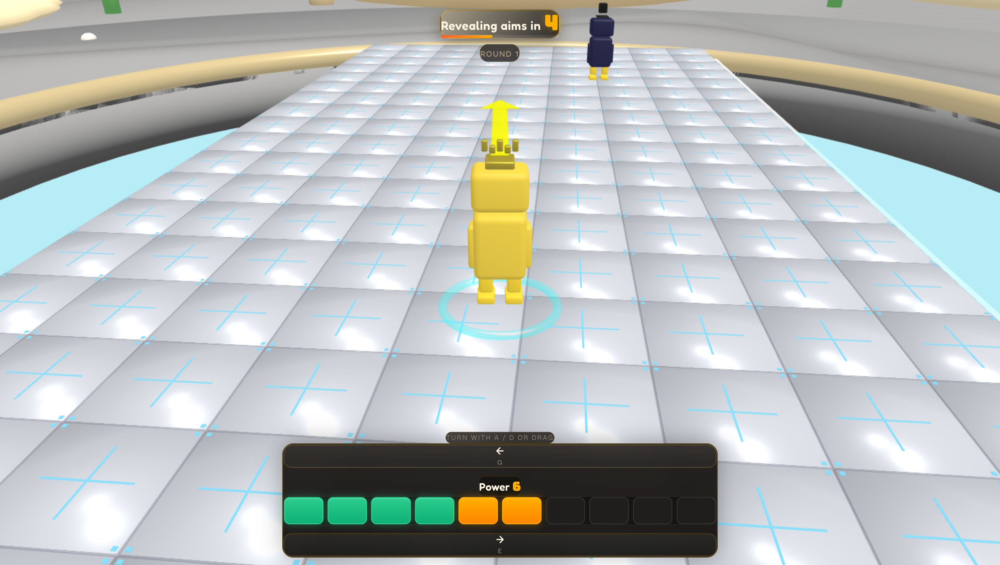
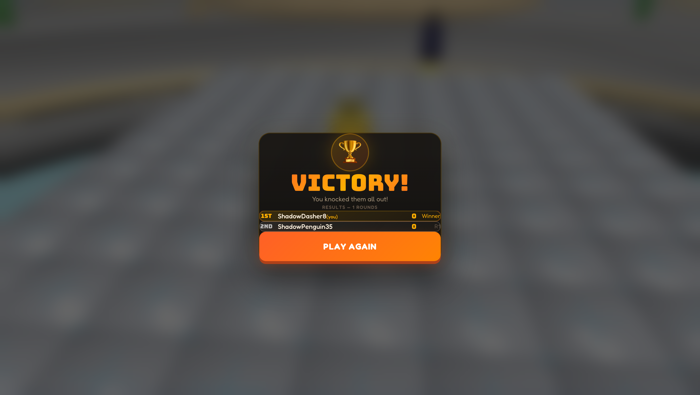

<p align="center">
  
  <br />
  <strong>Penguin Battle Royale</strong>
  <br />
  <em>Knock your opponents off the platform. Last penguin standing wins.</em>
</p>

<p align="center">
  
  
  
  
  
</p>

---

## What is Knockout?

Knockout is a real-time multiplayer 3D game where players control penguins on a shrinking platform. Each round, players choose a direction and power level — then all penguins launch simultaneously, bouncing off each other. Fall off the edge and you're eliminated. The last penguin standing wins.

## Screenshots

<p align="center">
  
</p>

<p align="center">
  
  
</p>

<p align="center">
  
  
</p>

## Tech Stack

| Layer | Technology | Purpose |
|-------|-----------|---------|
| **Frontend** | Next.js 16 (App Router) | Server & client rendering, routing |
| **3D Engine** | Babylon.js 7 | Real-time 3D arena, penguin models, physics visualization |
| **Styling** | Tailwind CSS 4 | Utility-first styling with custom design tokens |
| **Animation** | Framer Motion | Page transitions and UI animations |
| **State** | Zustand | Client-side game state and auth persistence |
| **Backend** | Go + Fiber v2 | WebSocket game server, REST API |
| **Physics** | Custom Go engine | Server-authoritative OBB collision with SAT |
| **Database** | PostgreSQL + Karma ORM | Game result persistence, player profiles |
| **Cache/PubSub** | Redis (Upstash) | Live game state, distributed locks, pub/sub events |
| **Monorepo** | Turborepo + Bun | Workspace orchestration and package management |
| **Schema** | Drizzle ORM | Database migrations and schema management |

## Architecture

```
┌─────────────────────────────────────────────────────────┐
│                      Client (Browser)                    │
│                                                         │
│  ┌──────────┐  ┌──────────┐  ┌────────────────────────┐ │
│  │ Next.js  │  │ Zustand  │  │     Babylon.js 3D      │ │
│  │  Pages   │──│  Stores  │──│  Engine + Penguins     │ │
│  └──────────┘  └──────────┘  └────────────────────────┘ │
│        │              │                    │             │
│        │         WebSocket ◄───────────────┘             │
│        │              │                                  │
└────────┼──────────────┼──────────────────────────────────┘
         │              │
    HTTP REST       WebSocket
         │              │
┌────────┼──────────────┼──────────────────────────────────┐
│        ▼              ▼           Server (Go)            │
│  ┌──────────┐  ┌──────────────┐                          │
│  │   REST   │  │  WS Handler  │                          │
│  │  Routes  │  │  (per conn)  │                          │
│  └──────────┘  └──────┬───────┘                          │
│        │              │                                  │
│        │     ┌────────┴────────┐                         │
│        │     │   Game Loop     │                         │
│        │     │  (per game)     │                         │
│        │     └────────┬────────┘                         │
│        │              │                                  │
│        │     ┌────────┴────────┐                         │
│        │     │ Physics Engine  │                         │
│        │     │  OBB + SAT      │                         │
│        │     │  Collision       │                         │
│        │     └─────────────────┘                         │
│        │                                                 │
│  ┌─────┴──────┐              ┌─────────────┐            │
│  │ PostgreSQL │              │    Redis     │            │
│  │  (Karma)   │              │  (Upstash)   │            │
│  │            │              │              │            │
│  │ - games    │              │ - game state │            │
│  │ - players  │              │ - pub/sub    │            │
│  └────────────┘              │ - dist locks │            │
│                              │ - sessions   │            │
│                              └──────────────┘            │
└──────────────────────────────────────────────────────────┘
```

### Game Flow

1. **Lobby** — Host creates a game, players join via 6-char code. Everyone walks around a stage area with their penguin.
2. **Countdown** — Each round, players aim their penguin (direction + power) within a time limit. Directions are hidden from opponents until the round resolves.
3. **Physics** — Server runs deterministic OBB collision simulation. Penguins launch, bounce off each other, and any that fall off the map are eliminated.
4. **Map Shrink** — After each elimination, the platform shrinks by 10%, making subsequent rounds increasingly chaotic.
5. **Victory** — Last penguin standing wins. Players can rematch instantly.

### Key Design Decisions

- **Server-authoritative physics** — All collision and movement is computed on the Go server. Clients receive position streams and animate interpolated playback.
- **Direction masking** — During countdown, opponents only see stale `public_direction` (from the previous round's end), preventing aim-sniping.
- **Position playback buffer** — Client buffers incoming position frames with a 75ms delay, sorted by server frame number, to smooth out network jitter.
- **Distributed game loop** — Redis SETNX locks ensure only one server instance runs the game loop per game, enabling horizontal scaling.

## Getting Started

### Prerequisites

- [Bun](https://bun.sh/) v1.3+
- [Go](https://go.dev/) 1.24+
- PostgreSQL 15+
- Redis (or [Upstash](https://upstash.com/))

### Setup

```bash
# Install dependencies
bun install

# Set up the database
cp services/server/.env.example services/server/.env  # configure DB + Redis URLs
bun run db:push                                        # push schema to PostgreSQL

# Start development
bun run start:server    # Go server on :9000
bun run dev             # Next.js on :3000
```

### Environment Variables

The Go server reads from `services/server/.env`:

| Variable | Description |
|----------|-------------|
| `DATABASE_URL` | PostgreSQL connection string |
| `REDIS_URL` | Redis connection string |
| `JWT_SECRET` | Secret for signing auth tokens |

## Project Structure

```
knockout.game/
├── apps/web/                  # Next.js frontend
│   ├── app/                   # App Router pages
│   │   ├── page.tsx           # Landing page
│   │   ├── create/            # Game creation
│   │   ├── join/              # Join via code
│   │   ├── game/[gameId]/     # Main game view
│   │   └── games/             # Match history
│   ├── components/game/       # Game UI overlays
│   │   ├── GameArena.tsx      # Babylon.js 3D renderer
│   │   ├── GameControls.tsx   # Aim + power controls
│   │   ├── GameHUD.tsx        # Scoreboard + round info
│   │   ├── GameOverOverlay.tsx
│   │   ├── LobbyOverlay.tsx
│   │   └── MobileJoystick.tsx # Touch controls
│   └── lib/                   # Stores, WS client, types
├── services/server/           # Go backend
│   └── internal/
│       ├── server/handlers/   # HTTP + WS handlers
│       ├── physics/           # Collision engine
│       ├── repository/        # Redis + PostgreSQL
│       └── models/            # Entities + claims
├── database/                  # Drizzle schema + migrations
└── package.json               # Turborepo workspace root
```

## License

Private project.
